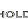
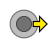

# Turbo Inputs
Thank you for reading the readme! You're a cool person!

<details> <summary> Only click here, if you wanna see the developer stuff </summary>

## Developement Instructions
1. In the root directory, run `npm install` to install all the project dependencies
2. Run `npm start` to start the dev server
3. Navigate to http://localhost:9966 (or the url provided after running `npm start`)

## Developement Commands
Below are a list of commands used for developement. The logic for all the commands are in the local `package.json`
- `npm start` - starts a server hosting the webapp on localhost using budo; will live update with changes
- `npm run build` - builds a final distributable using browserify
- `npm test` - runs tests in jasmine

</details>

# Fighting Input Language
So if there is a game which doesn't yet exist on turbo inputs, I've created a language that will make it easy (hopefully) to add your own lists

## General syntax
The fighting input language has two types of syntaxes depending on what you are writing.

Dot delimitation is used for inputs and tags. Any time you need to define multiple inputs or tags, simply put a `.` with no space. For example if I wanted to place a punch input after a quarter circle forward, I could write that as `236.p` where `236` is the quarter circle motion, and `p` is shorthand for punch.

Colon delimitation is used for everything else. When writing characters, moves, new inputs, or anything that isn't a input or tag, use colons between each parameter. Most parameters are optional, and can be skipped or ignored.

### Defining keywords
You can define and alias things for later use by using an `->`, like below
```
qcf -> 236
```
With the line above, you could write `qcf` anywhere you would write `236`. Read the sections below about what parameters keywords take in.

## Games & Characters
A game and version can be declared using the syntax:
```
game:Street Fighter II:Turbo
```
Where "Street Fighter II" is the game, and "Turbo" is the version (version is optional).

Characters can be added by the syntax below
```
character:Ryu
```
Once you put a character line, all moved below it will belong to that character (until you write a new character or version line)

## Moves
A move is constructed of 5 parts
```
special:Hadouken:236.p:projectile:speed changes based on level of [p]
```
The parts are as follows: move type, move name, move input, tags, and notes. Notes takes in anything, and if you want to reference an input, place it in square brackets `[ ]` to have it display correctly. You can read more about the other parameters in their respective sections. All parts are optional.

### Defining move types
You can define your own move type with the syntax below
```
command -> move:#bbb
```
Where `#bbb` is the color you want to use for the move. As with all colors, 3 or 6 digit hexadecimal is accepted. The text inside the move is automatically adjusted to be black or white depending on this color.

## Inputs
As mentioned above, a string of inputs can be expressed with dots between them.

Defined by default are the following, along with their parameters for making new inputs based on these existing ones:

Input | keyword | arguments
--- | --- | ---
 | `p` | background color, foreground color, overlay text, text size, horizontal text offset, vertical text offset
 | `k` | background color, foreground color, overlay text, text size, horizontal text offset, vertical text offset
 | `cb` | button color, text, text size, horizontal text offset, vertical text offset
 | `ct` | text, shadow, size, horizontal offset, vertical offset, stroke width
 | `air` | no extra parameters
 | `>` | no extra parameters
 | `(` | flip
 | `)` | no extra parameters
 | `6` | flip, rotation |
 | `623` | flip, rotation
 | `236` | flip, rotation
 | `41236` | flip, rotation
 | `63214789` | flip, rotation

You can use numbers `1` through `9` to express different arrows (they correlate to the numpad, where 6 is forward and 4 is backwards). Also the motion inputs (quarter circle forward, half circle forward, etc...) have mappings to their flipped version by typing the numbers for the backwards version.

So if you needed to create a hold punch button, you could do so by this syntax
```
p_hold -> p:#000:#7d9fbd:HOLD:1.3:135:0
```

## Tags
Tags are simple ways to indicate that the move has special properties. Things like `Multi-hit`, `Projectile`, `Anti-air` might be good tags. Games like Alpha 3 has certain moves that fall under `X-ISM`, `A-ISM`, and `V-ISM`- and games like Killer Instinct has moves that fall into multiple categories like `Enders`, `Starters`- these are perfect examples of where tags can be useful to categories moves.

A tag is built with just 2 parameters. Below is an example of defining and using the `*-ISM` tags that exist in games like alpha 3
```
X-ISM -> tag:X-ISM:#900
A-ISM -> tag:A-ISM:#090
character:Rose
super:Aura Soul Throw:236.2.3.p:X-ISM.A-ISM
```
Tags are nice because they are re-usable, and a move can have multiple tags at once.
